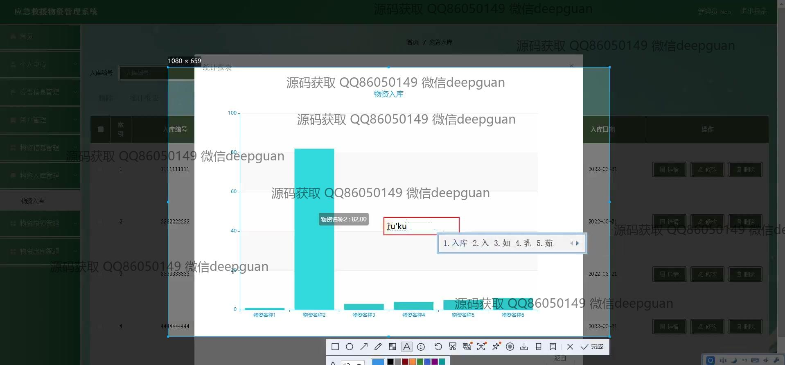

<h1 align="center">应急救援物资管理系统</h1>

## 简介
应急救援物资管理系统：功能包括个人中心、公告信息管理、用户管理、物资信息管理、物资入库与出库管理，提供便捷的申请、审核、统计与出入库操作，实现高效的物资分配与管理。    --计算机毕业设计源码；毕设源码；java毕业设计源码

## 联系方式

<h3 align="center">获取完整代码与数据库文件 + 微信：deepguan QQ: 86050149 QQ群: 783742310</h3>

<h3 align="center">可帮忙远程部署 包运行成功！提供远程部署、修改代码、设计文档指导、代码讲解等服务！</h3>

## 功能介绍（完整见运行截图）
管理员：主要具备登录、注册和退出的基本功能。在系统中，管理员可以通过导航栏访问各个模块，包括首页、个人中心、公告信息管理、用户管理、物资信息管理、入库管理、物资申请领取与出库管理。管理员能够审核物资申请，通过审核对话框设定申请状态和备注，并确认或取消操作。此外，管理员还可查看和编辑用户信息，管理物资的入库、出库等具体细节，并通过统计报告功能进行库存分析，提升管理效率。

用户：用户拥有登录、注册和退出的基本功能。登录后，用户可以访问个人中心和管理系统的各个模块。用户可以在个人中心修改个人信息，并上传头像。用户能够申请应急物资，填写申请表单中的必要信息如物资名称、数量、联系人信息等，提交和取消操作均可实现。同时，用户还可以查看公告信息和管理自己的物资出入库记录，有效协调和跟踪个人物资申请与使用情况，通过可视化的图表工具辅助管理。

## 运行截图

本代码来源于网络,仅供学习参考使用!

